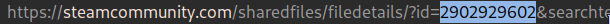

# Video Wallpaper Scripts

Some scripts to make setting a video/gif as your wallpaper on linux easier. Supports Wayland and Xorg.

Tested working on Arch with:

- Gnome
- Xfce
- Cinnamon (works with desktop icons)
- KDE (recommend to use [this](https://github.com/catsout/wallpaper-engine-kde-plugin) instead)
- Mate
- Xmonad
- Qtile
- i3
- Herbstluftwm
- Awesome

Not tested on other distros and BSPWM

##### Change wallpaper quickly using setwall script


##### Fully in background


## Dependencies

- [xwinwrap-git](https://aur.archlinux.org/packages/xwinwrap-git/) (AUR)
- mplayer
- ffmpeg
- gifsicle
- xclip
- vlc (optional)
- [Wallpaper Engine](https://store.steampowered.com/app/431960/Wallpaper_Engine/) (optional but recommended)

## Installation

1. Clone the repository
2. Make install.sh executable if needed
3. Run install.sh
4. Add wallhelper to your path if you want

# Usage

## Wallhelper script

This script is meant to be used together with wallpaper engine to make things easier when setting a video as your wallpaper.

It can also add wallpapers manually without wallpaper engine if you specify the path using `wallhelper -a <path_to_mp4/gif>`.

### With Wallpaper Engine

#### Previewing a wallpaper

1. Make sure the wallpaper you want to preview is already downloaded in your steam library
2. - Copy the url of the wallpaper you want to preview, and run the wallhelper script using the following command: `wallhelper -p`.
   - Alternatively, you can also specify the wallpaper id as an argument to the script: `wallhelper -p <wallpaper_id>`. The wallpaper id can be found in the url of any wallpapers you subscribed to.
   - 

3. The script will open mplayer/vlc to preview your wallpaper.


#### Setting a wallpaper

1. Make sure wallpaper engine is downloaded and in your steam library
2. Go to wallpaper engine properties and enable 'Force the use of a specific Steam Play compatability tool' in the Compatability tab
3. Visit the [Wallpaper Engine Workshop](https://steamcommunity.com/workshop/browse/?appid=431960), login and browse for a video you want to use as your wallpaper. (**Note:** Filter by 'Video' format since this script does not support any other format such as scene or html)
4. Subscribe to a wallpaper you like and wait for it to finish downloading
5. - Copy the url of the wallpaper you just subscribed to, and run the wallhelper script using the following command: `wallhelper`.

   

   - Alternatively, you can also specify the wallpaper id as an argument to the script: `wallhelper <wallpaper_id>`. The wallpaper id can be found in the url of any wallpapers you subscribed to.

   

6. The script will now look for the wallpaper in your steam workshop folder and copy it to `~/.config/video-wallpapers/wallpapers/`. You can use setwall script to cycle through the wallpapers in this folder.

If you want to add your own video/gif as a wallpaper, you can use the following command: `wallhelper -a <path_to_mp4/gif>`. This will copy the video/gif to `~/.config/video-wallpapers/wallpapers/`.

The script can also read the video/gif directory from the clipboard if you use `wallhelper -a` or `wallhelper` without any arguments.

#### Optimizing a wallpaper

##### Optimizing the last added wallpaper

1. Run the wallhelper script using the following command: `wallhelper -o`.
2. This will optimize the last added wallpaper in `~/.config/video-wallpapers/wallpapers/` using ffmpeg if it's a mp4 or gifsicle if it's a gif.

##### Batch optimizing

You can:

- Optimize all wallpapers in the wallpaper directory using `wallhelper -o all`
- Optimize all gifs in the wallpaper directory using `wallhelper -o gif`
- Optimize all mp4s in the wallpaper directory using `wallhelper -o mp4`

**Gifs must be optimized so that it is at your screen resolution, it will not auto stretch to your screen resolution!**

##### Unoptimized (4k choppy video)


##### Optimized (native resolution smoother video)


#### Deleting a wallpaper

1. Run the wallhelper script using the following command: `wallhelper -d`.
2. This will delete the last added wallpaper in `~/.config/video-wallpapers/wallpapers/`.
3. Alternatively, you can use `wallhelper -d <wallpaper-number>` to delete a specific wallpaper. (**Note:** The wallpaper number is the number in the name of the wallpaper in `~/.config/video-wallpapers/wallpapers/`, it is not the same as wallpaper id)


### Without Wallpaper Engine (Manual wallpaper adding)

The script can also be used without wallpaper engine. However, you will only be able to use the optimizing, custom adding and deleting functions of the script.

To add a wallpaper without having wallpaper engine:

###### Automatic adding

1. Download a video you want to use as your wallpaper
2. Use the following command: `wallhelper -a <path_to_mp4/gif>`
3. Alternatively, you can also use `wallhelper -a` and the script will read the path from the clipboard

###### Manual adding

1. Download a video you want to use as your wallpaper
2. Move the video to `~/.config/video-wallpapers/wallpapers/`
3. Rename the video so that it is incremental (e.g. 1.mp4, 2.mp4, 3.mp4, etc.)

Deletion and optimization works the same as with wallpaper engine.

---

## Setwall script

This script is used to cycle through wallpapers in `~/.config/video-wallpapers/wallpapers/` and set them as your wallpaper. It now supports mp4 and gif.

Gif wallpapers are implemented using gifview and mp4 wallpapers are implemented using mplayer. I hope to implement html wallpapers in the future.

Gifs must be optimized so that it is at your screen resolution, it will not auto stretch to your screen resolution!

It is recommended to use this script with a keybind. (e.g. Super+Alt+W)


# Autostart

Add the following to your xprofile to autostart video wallpaper:

```sh
var=$(cat $HOME/.config/video-wallpapers/wallpaperVar)
newvar=$((var - 1))
if [ $newvar -eq 0 ]; then
    newvar=$(ls $HOME/.config/video-wallpapers/wallpapers | wc -l)
fi
xwinwrap -fs -ni -nf -b -un -ov -- mplayer -wid %WID -quiet -nosound $HOME/.config/video-wallpapers/wallpapers/$newvar.mp4 -loop 0 -nolirc -nomouseinput & # set the background
```

---

#### RAM consumption

Base on my tests, mplayer only takes up less tha 300MB RAM. It should not cause significant slowdowns on your system.

#### Why not mpv?

Mpv made my system slow down much more than mplayer, therefore i decided to use mplayer instead. You could try using mpv and see if it works better for you.
